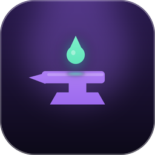

<p align="center">
  
</p>

<h1 align="center">Fragua</h1>

<p align="center">
  Escáner web ligero que detecta vulnerabilidades comunes y las exporta a
  <a href="https://github.com/D3M0NH4NT3R/Crisol-RX">Crisol-RX</a>.
</p>

<p align="center">
  
  
  
  
</p>

---

**Fragua** escanea un activo web, comprueba fallos de configuración, cabeceras,
TLS y superficie común (**de forma segura y no destructiva**) y **genera un
fichero JSON** que subes tú a Crisol-RX. No sube nada por API: solo produce el
archivo.

Misma filosofía que Crisol-RX: **sin dependencias** (solo la librería estándar de
Go) y **un único binario**. Cross-compila para Windows, macOS (Apple Silicon e
Intel) y Linux, incluyendo ARM64.

> ⚠️ **Uso ético.** Escanea únicamente activos para los que tengas autorización.

---

## Instalación

### Binarios precompilados

Descarga el binario de tu plataforma desde la
[página de releases](https://github.com/D3M0NH4NT3R/Fragua/releases).

### Compilar desde el código

```bash
git clone https://github.com/D3M0NH4NT3R/Fragua.git
cd Fragua
go build -o fragua .
```

Para todas las plataformas de golpe (binarios en `dist/`):

```bash
./build.sh
```

Genera: `fragua-linux-amd64`, `fragua-linux-arm64`, `fragua-macos-intel`,
`fragua-macos-apple-silicon`, `fragua-windows-amd64.exe` y
`fragua-windows-arm64.exe`. No necesita CGO ni toolchains externas.

## Uso

```bash
./fragua --url https://objetivo.ejemplo --out objetivo.json
```

Luego, en Crisol-RX, sube el JSON con cualquiera de los dos:

- **Importar workspace** → crea un workspace nuevo con un proyecto y las vulnerabilidades.
- **Importar resultados de escaneo** (dentro de un proyecto) → añade los hallazgos al proyecto abierto.

### Opciones

| Opción | Para qué |
|---|---|
| `--url` | Activo a escanear (obligatorio). Si no pones esquema, se asume `https://`. |
| `--lang` | Idioma del reporte: `es` (por defecto), `en` o `both`. |
| `--out` | Fichero de salida. Por defecto `crisol-<host>.json`. |
| `--name` | Nombre del workspace/proyecto (por defecto, el host). |
| `--insecure` | No verificar el certificado TLS del objetivo. |
| `--timeout` | Timeout por petición en segundos (por defecto 15). |
| `--max-pages` | Nº máximo de páginas a rastrear del mismo dominio (por defecto 20). |
| `--no-crawl` | No rastrear enlaces; escanear solo la URL dada. |

### Idioma del reporte

- Sin `--lang` → reporte en **español** (por defecto).
- `--lang en` → reporte en **inglés**.
- `--lang both` → genera **dos ficheros**, uno en español y otro en inglés, con
  sufijo de idioma (`crisol-<host>-es.json` y `crisol-<host>-en.json`; con
  `--out objetivo.json` salen `objetivo-es.json` y `objetivo-en.json`).

> En modo `both` el activo se escanea una vez por idioma. Si prefieres no duplicar
> el tráfico, genera cada idioma por separado con `--lang es` / `--lang en`.

## Qué comprueba

Comprobaciones pasivas y activas ligeras, todas **GET/OPTIONS/TRACE y no
destructivas**. Por defecto **rastrea el mismo dominio** (hasta `--max-pages`) y
repite las comprobaciones por página.

**Transporte y TLS**
- Comunicación sin cifrar (HTTP) y HTTP que no redirige a HTTPS.
- Certificado: caducado, próximo a caducar, autofirmado o cadena incompleta,
  host no cubierto (CN/SAN), firma débil (SHA-1/MD5) y clave RSA corta.
- Protocolos obsoletos soportados (TLS 1.0 / 1.1) y suites de cifrado débiles.

**Cabeceras**
- CSP ausente **o débil** (`unsafe-inline`, `unsafe-eval`, comodines).
- Anti-clickjacking, X-Content-Type-Options, Referrer-Policy, Permissions-Policy.
- HSTS ausente o débil; COOP y CORP; X-XSS-Protection deshabilitada.
- Divulgación de tecnología (Server, X-Powered-By, generator…).

**Configuración y superficie**
- Cookies sin Secure / HttpOnly / SameSite.
- CORS mal configurado (comodín con credenciales).
- Métodos HTTP peligrosos (PUT/DELETE/PATCH/CONNECT/TRACE/TRACK) y método TRACE (XST).
- Autenticación Basic sobre HTTP.
- Listado de directorios habilitado.
- Política de dominio cruzado permisiva (`crossdomain.xml`, `clientaccesspolicy.xml`).
- Ficheros sensibles expuestos: `.git`, `.env`, `.svn`, `web.config`,
  `wp-config.php.bak`, `.htpasswd`, `phpinfo.php`, `.aws/credentials`,
  `docker-compose.yml`, `backup.sql`, `actuator/health`, `appsettings.json`,
  `WEB-INF/web.xml`, `server-status`, `security.txt`, y más.
- `robots.txt` que revela rutas internas y detección de stack (WordPress/Drupal/Joomla).

**Fugas de información (en el cuerpo)**
- Clave privada (PEM) servida, trazas de error / SQL, IPs internas y correos.

**Por página**
- Posible **XSS reflejado** (marcador benigno; requiere confirmación manual).
- **Contenido mixto** (recurso HTTP en página HTTPS).
- **Formulario de credenciales sin cifrar**.

No es un DAST completo (no reemplaza a Burp/ZAP ni prueba SQLi a fondo o lógica de
negocio). Cubre configuración, cabeceras, TLS y superficie común, y deja los
hallazgos listos para revisar y ampliar en Crisol-RX. Los hallazgos repetidos se
deduplican por título + activo.

## Compilación avanzada

**Icono en el `.exe`.** En Windows el icono se incrusta en el ejecutable durante
`./build.sh` mediante [go-winres](https://github.com/tc-hib/go-winres):

```bash
go install github.com/tc-hib/go-winres@latest   # una vez
./build.sh
```

**Ofuscación.** Si tienes [garble](https://github.com/burrowers/garble)
instalado, `build.sh` ofusca el binario (nombres, literales y metadatos). No añade
dependencias; es solo una herramienta de build. Forzar sin ofuscar:
`NO_OBFUSCATE=1 ./build.sh`.

**Iconos.** El diseño vive en `assets/` (`fragua.svg`, PNGs, `fragua.ico`,
`fragua.icns`). Se regeneran con `python3 assets/make_icon.py`.

## Formato de salida

El fichero es el formato `crisol-workspace` (el mismo de «Exportar workspace» de
Crisol-RX), por eso Crisol lo importa tal cual.

## Uso ético y responsabilidad

Fragua realiza peticiones a un objetivo remoto. **Escanéalo solo si tienes
autorización explícita.** El autor no se responsabiliza de un uso indebido.

## Licencia

Ver [LICENSE](LICENSE). Atribución al autor original obligatoria.

---

<p align="center">
  Hecho por <a href="https://github.com/D3M0NH4NT3R">D3M0NH4NT3R</a> · complemento de
  <a href="https://github.com/D3M0NH4NT3R/Crisol-RX">Crisol-RX</a>
</p>
